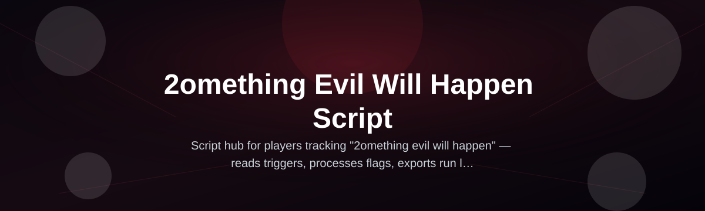
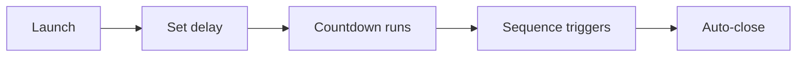

# something-evil-script-hub

*A one-file prank sequencer for people who want their PC to look possessed on command.*

## What this is

something-evil-script-hub is a standalone Windows tool built around a single idea: the "2omething evil will happen" script — a countdown-style sequence that quietly builds tension on screen before triggering a scripted effect. No install wizard, no background service, just a `.exe` you run when you want a screen to feel like something is about to go wrong.

It was written by a solo developer who was tired of prank tools that needed five dependencies and a tutorial video just to show a fake glitch. The whole point of the 2omething evil will happen script is that you double-click it, pick a delay, and walk away — the tension and payoff happen without you touching the keyboard again.

  

The button above opens the project's download page.

## Who it is for

- Streamers who want a scripted jumpscare moment mid-stream without editing footage later
- Friends setting up a shared-computer prank that needs to feel unplanned
- Content creators recording reaction videos who need a repeatable, timed trigger
- Office pranksters who want something that resets cleanly with no trace left behind
- Anyone curious what a "2omething evil will happen" countdown actually looks like on their own screen

## What you can do

- **Set a custom delay** before the sequence starts, from a few seconds to several hours
- **Choose between multiple visual sequences** instead of one fixed animation
- **Run it fully offline** — nothing phones home, nothing needs a connection to start
- **Cancel mid-countdown** with a hidden key combo if the timing goes wrong
- **Keep it silent or add sound** depending on whether you want the target to hear it coming
- **Auto-close after the sequence ends** so the desktop returns to normal on its own
- **Run it from a USB stick** on any Windows machine without leaving files behind
- **Trigger it manually or on a schedule** if you want it to fire at an exact moment

## Getting started

1. Open the download page using the button on this repository.
2. Download the latest standalone build for Windows.
3. Extract the folder if it arrives zipped — no installer runs.
4. Double-click the executable and pick your delay and sequence.
5. Let the countdown run; the script handles the rest on its own.

## Requirements

- Windows 10 or Windows 11 (64-bit)
- No .NET, Python, or Node installation required
- No admin rights needed for normal use
- No build tools, compilers, or package managers involved — it's a finished binary

## How it works

The 2omething evil will happen script is built as a linear state machine: it waits, escalates, then resolves.

1. You launch the executable and choose a delay window.
2. The tool sits quietly in the background — no visible window, no tray icon.
3. When the timer hits zero, the chosen visual sequence plays.
4. The sequence resolves on its own after a few seconds.
5. The program closes itself, leaving the desktop as it was.

## FAQ

**Is the 2omething evil will happen script actually harmful to my PC?**
No. It only changes what appears on screen for a short time. It doesn't touch files, settings, or system processes.

**Can I stop the countdown once it's started?**
Yes, there's a cancel key combo shown on first launch that halts the sequence before it triggers.

**Does it work on Windows 7 or older versions?**
It's built and tested for Windows 10/11. Older versions aren't supported and may render the effects incorrectly.

**Will antivirus software flag this as malicious?**
Some antivirus tools flag unsigned executables that draw over the screen, even when they're harmless. Check the landing page for current guidance on this.

**Can I use my own images or sounds in the sequence?**
Not in the current build. Custom asset support is on the list for a future update.

## Troubleshooting

- **The window won't close after the sequence ends** — press the cancel key combo shown on launch, or end the process from Task Manager.
- **Nothing happens after the countdown reaches zero** — your display scaling may be set above 100%; try running at default scaling.
- **Sound doesn't play during the sequence** — check that your default output device is set correctly in Windows sound settings.
- **Antivirus quarantines the file on download** — this happens with unsigned screen-drawing tools; restore it from quarantine after verifying the source on the landing page.

## License

Released under the [MIT License](LICENSE). This project is intended for pranks, streaming content, and personal entertainment on machines you own or have permission to use. The author isn't responsible for reactions you can't take back.

  

